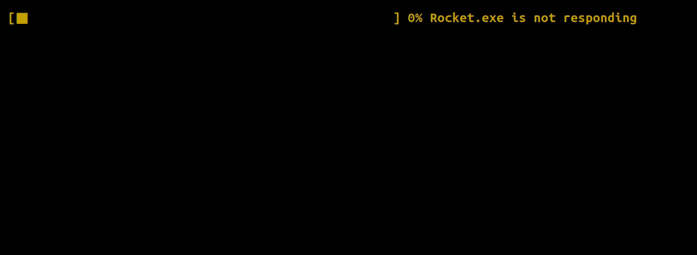
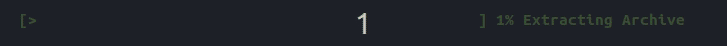
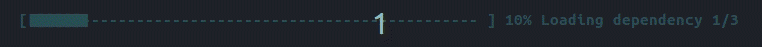
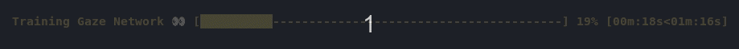
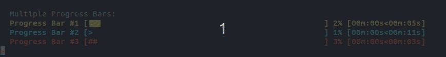

<p align="center">
    
</p>

<p align="center">
  <a href="https://travis-ci.com/p-ranav/indicators">
    
  </a>
  <a href="https://www.codacy.com/manual/p-ranav/indicators?utm_source=github.com&amp;utm_medium=referral&amp;utm_content=p-ranav/indicators&amp;utm_campaign=Badge_Grade">
    
  </a>
  <a href="https://github.com/p-ranav/indicators/blob/master/LICENSE">
    
  </a>
  
</p>


<p align="center">
   
</p>

## Highlights

* Thread-safe progress bars and spinners
* Header-only library. Grab a copy of `include/indicators`. 
* Single-header version in `single_include/indicators`.
* Source for the above GIF can be found [here](demo/demo.cpp)
* MIT License

## Table of Contents

*    Supported Indicators
     *    [Basic Progress Bar](#basic-progress-bar)
     *    [Indeterminate Progress Bar](#indeterminate-progress-bar)
     *    [Block Progress Bar](#block-progress-bar)
     *    [Multi Progress](#multiprogress)
     *    [Dynamic Progress](#dynamicprogress)
     *    [Progress Spinner](#progress-spinner)
*    Additional Samples
     *    [Decremental Progress](#decremental-progress)
     *    [Working with Iterables](#working-with-iterables)
     *    [Unicode Support](#unicode-support)
*    [Building Samples](#building-samples)
*    [Generating Single Header](#generating-single-header)
*    [Contributing](#contributing)
*    [License](#license)

## Basic Progress bar

To introduce a progress bar in your application, include `indicators/progress_bar.hpp` and create a `ProgressBar` object. Here's the general structure of a progress bar:

```
{prefix} {start} {fill} {lead} {remaining} {end} {percentage} [{elapsed}<{remaining}] {postfix}
         ^^^^^^^^^^^^^ Bar Width ^^^^^^^^^^^^^^^   
```

The amount of progress in ProgressBar is maintained as a `size_t` in range `[0, 100]`. When progress reaches 100, the progression is complete. 

From application-level code, there are two ways in which you can update this progress:

### Update progress using `bar.tick()`

You can update the progress bar using `bar.tick()` which increments progress by exactly `1%`.

<p align="center">
    
</p>

```cpp
#include <indicators/progress_bar.hpp>
#include <thread>
#include <chrono>

int main() {
  using namespace indicators;
  ProgressBar bar{
    option::BarWidth{50},
    option::Start{"["},
    option::Fill{"="},
    option::Lead{">"},
    option::Remainder{" "},
    option::End{"]"},
    option::PostfixText{"Extracting Archive"},
    option::ForegroundColor{Color::green},
    option::FontStyles{std::vector<FontStyle>{FontStyle::bold}}
  };
  
  // Update bar state
  while (true) {
    bar.tick();
    if (bar.is_completed())
      break;
    std::this_thread::sleep_for(std::chrono::milliseconds(100));
  }

  return 0;
}
```

The above code will print a progress bar that goes from 0 to 100% at the rate of 1% every 100 ms.

### Updating progress using `bar.set_progress(value)`

If you'd rather control progress of the bar in discrete steps, consider using `bar.set_progress(value)`. Example:


<p align="center">
    
</p>

```cpp
#include <chrono>
#include <indicators/cursor_control.hpp>
#include <indicators/progress_bar.hpp>
#include <thread>

int main() {
  using namespace indicators;

  // Hide cursor
  show_console_cursor(false);

  ProgressBar bar{
    option::BarWidth{50},
    option::Start{"["},
    option::Fill{"■"},
    option::Lead{"■"},
    option::Remainder{"-"},
    option::End{" ]"},
    option::PostfixText{"Loading dependency 1/4"},
    option::ForegroundColor{Color::cyan},
    option::FontStyles{std::vector<FontStyle>{FontStyle::bold}}
  };

  // Update bar state
  bar.set_progress(10); // 10% done

  // do some work
  std::this_thread::sleep_for(std::chrono::milliseconds(800));

  bar.set_option(option::PostfixText{"Loading dependency 2/4"});  

  bar.set_progress(30); // 30% done

  // do some more work
  std::this_thread::sleep_for(std::chrono::milliseconds(700));

  bar.set_option(option::PostfixText{"Loading dependency 3/4"});  

  bar.set_progress(65); // 65% done

  // do final bit of work
  std::this_thread::sleep_for(std::chrono::milliseconds(900));

  bar.set_option(option::PostfixText{"Loaded dependencies!"});

  bar.set_progress(100); // all done

  // Show cursor
  show_console_cursor(true);

  return 0;
}
```

### Showing Time Elapsed/Remaining

All progress bars and spinners in `indicators` support showing time elapsed and time remaining. Inspired by python's [tqdm](https://github.com/tqdm/tqdm) module, the format of this meter is `[{elapsed}<{remaining}]`:

<p align="center">
    
</p>

```cpp
#include <chrono>
#include <indicators/cursor_control.hpp>
#include <indicators/progress_bar.hpp>
#include <thread>

int main() {
  using namespace indicators;

  // Hide cursor
  show_console_cursor(false);

  indicators::ProgressBar bar{
    option::BarWidth{50},
    option::Start{" ["},
    option::Fill{"█"},
    option::Lead{"█"},
    option::Remainder{"-"},
    option::End{"]"},
    option::PrefixText{"Training Gaze Network 👀"},
    option::ForegroundColor{Color::yellow},
    option::ShowElapsedTime{true},
    option::ShowRemainingTime{true},
    option::FontStyles{std::vector<FontStyle>{FontStyle::bold}}
  };

  // Update bar state
  while (true) {
    bar.tick();
    if (bar.is_completed())
      break;
    std::this_thread::sleep_for(std::chrono::milliseconds(1000));
  }

  // Show cursor
  show_console_cursor(true);

  return 0;
}
```

## Indeterminate Progress Bar

You might have a use-case for a progress bar where the maximum amount of progress is unknown, e.g., you're downloading from a remote server that isn't advertising the total bytes. 

Use an `indicators::IndeterminateProgressBar` for such cases. An `IndeterminateProgressBar` is similar to a regular progress bar except the total amount to progress towards is unknown. Ticking on this progress bar will happily run forever. 

When you know progress is complete, simply call `bar.mark_as_completed()`. 

<p align="center">
    
</p>

```cpp
#include <chrono>
#include <indicators/indeterminate_progress_bar.hpp>
#include <indicators/cursor_control.hpp>
#include <indicators/termcolor.hpp>
#include <thread>

int main() {
  indicators::IndeterminateProgressBar bar{
      indicators::option::BarWidth{40},
      indicators::option::Start{"["},
      indicators::option::Fill{"·"},
      indicators::option::Lead{"<==>"},
      indicators::option::End{"]"},
      indicators::option::PostfixText{"Checking for Updates"},
      indicators::option::ForegroundColor{indicators::Color::yellow},
      indicators::option::FontStyles{
          std::vector<indicators::FontStyle>{indicators::FontStyle::bold}}
  };

  indicators::show_console_cursor(false);

  auto job = [&bar]() {
    std::this_thread::sleep_for(std::chrono::milliseconds(10000));
    bar.mark_as_completed();
    std::cout << termcolor::bold << termcolor::green 
        << "System is up to date!\n" << termcolor::reset;
  };
  std::thread job_completion_thread(job);

  // Update bar state
  while (!bar.is_completed()) {
    bar.tick();
    std::this_thread::sleep_for(std::chrono::milliseconds(100));
  }

  job_completion_thread.join();
  
  indicators::show_console_cursor(true);  
  return 0;
}
```

## Block Progress Bar

Are you in need of a smooth block progress bar using [unicode block elements](https://en.wikipedia.org/wiki/Block_Elements)? Use `BlockProgressBar` instead of `ProgressBar`. Thanks to [this blog post](https://mike42.me/blog/2018-06-make-better-cli-progress-bars-with-unicode-block-characters) for making `BlockProgressBar` an easy addition to the library. 

<p align="center">
    
</p>

```cpp
#include <indicators/block_progress_bar.hpp>
#include <thread>
#include <chrono>

int main() {

  using namespace indicators;

  // Hide cursor
  show_console_cursor(false);

  BlockProgressBar bar{
    option::BarWidth{80},
    option::Start{"["},
    option::End{"]"},
    option::ForegroundColor{Color::white}  ,
    option::FontStyles{std::vector<FontStyle>{FontStyle::bold}}
  };
  
  // Update bar state
  auto progress = 0.0f;
  while (true) {
    bar.set_progress(progress);
    progress += 0.25f;
    if (bar.is_completed())
      break;
    std::this_thread::sleep_for(std::chrono::milliseconds(50));
  }

  // Show cursor
  show_console_cursor(true);

  return 0;
}
```

## MultiProgress

`indicators` supports management of multiple progress bars with the `MultiProgress` class template. 

`template <typename Indicator, size_t count> class MultiProgress` is a class template that holds references to multiple progress bars and provides a safe interface to update the state of each bar. `MultiProgress` works with both `ProgressBar` and `BlockProgressBar` classes.

Use this class if you know the number of progress bars to manage at compile time.

Below is an example `MultiProgress` object that manages three `ProgressBar` objects.

<p align="center">
    
</p>

```cpp
#include <indicators/multi_progress.hpp>
#include <indicators/progress_bar.hpp>

int main() {
  using namespace indicators;
  // Configure first progress bar
  ProgressBar bar1{
    option::BarWidth{50},
    option::Start{"["},
    option::Fill{"■"},
    option::Lead{"■"},
    option::Remainder{" "},
    option::End{" ]"},
    option::ForegroundColor{Color::yellow},
    option::ShowElapsedTime{true},
    option::ShowRemainingTime{true},
    option::PrefixText{"Progress Bar #1 "},
    option::FontStyles{std::vector<FontStyle>{FontStyle::bold}}
  };

  // Configure second progress bar

  ProgressBar bar2{
    option::BarWidth{50},
    option::Start{"["},
    option::Fill{"="},
    option::Lead{">"},
    option::Remainder{" "},
    option::End{" ]"},
    option::ForegroundColor{Color::cyan},
    option::ShowElapsedTime{true},
    option::ShowRemainingTime{true},
    option::PrefixText{"Progress Bar #2 "},
    option::FontStyles{std::vector<FontStyle>{FontStyle::bold}}
  };
  
  // Configure third progress bar
  indicators::ProgressBar bar3{
    option::BarWidth{50},
    option::Start{"["},
    option::Fill{"#"},
    option::Lead{"#"},
    option::Remainder{" "},
    option::End{" ]"},
    option::ForegroundColor{Color::red},
    option::ShowElapsedTime{true},
    option::ShowRemainingTime{true},
    option::PrefixText{"Progress Bar #3 "},
    option::FontStyles{std::vector<FontStyle>{FontStyle::bold}}
  };

  // Construct MultiProgress object
  indicators::MultiProgress<indicators::ProgressBar, 3> bars(bar1, bar2, bar3);

  std::cout << "Multiple Progress Bars:\n";

  auto job1 = [&bars]() {
    while (true) {
      bars.tick<0>();
      if (bars.is_completed<0>())
        break;
      std::this_thread::sleep_for(std::chrono::milliseconds(100));
    }
  };

  auto job2 = [&bars]() {
    while (true) {
      bars.tick<1>();
      if (bars.is_completed<1>())
        break;
      std::this_thread::sleep_for(std::chrono::milliseconds(200));
    }
  };

  auto job3 = [&bars]() {
    while (true) {
      bars.tick<2>();
      if (bars.is_completed<2>())
        break;
      std::this_thread::sleep_for(std::chrono::milliseconds(60));
    }
  };

  std::thread first_job(job1);
  std::thread second_job(job2);
  std::thread third_job(job3);

  first_job.join();
  second_job.join();
  third_job.join();

  return 0;
}
```

## DynamicProgress

`DynamicProgress` is a container class, similar to `MultiProgress`, for managing multiple progress bars. As the name suggests, with `DynamicProgress`, you can dynamically add new progress bars. 

To add new progress bars, call `bars.push_back(new_bar)`. This call will return the index of the appended bar. You can then refer to this bar with the indexing operator, e.g., `bars[4].set_progress(55)`.  

Use this class if you don't know the number of progress bars at compile time.

Below is an example `DynamicProgress` object that manages six `ProgressBar` objects. Three of these bars are added dynamically.

<p align="center">
    
</p>

```cpp
#include <indicators/dynamic_progress.hpp>
#include <indicators/progress_bar.hpp>
using namespace indicators;

int main() {

  ProgressBar bar1{option::BarWidth{50}, option::ForegroundColor{Color::red},
                   option::ShowElapsedTime{true}, option::ShowRemainingTime{true},
                   option::PrefixText{"5c90d4a2d1a8: Downloading "}};

  ProgressBar bar2{option::BarWidth{50}, option::ForegroundColor{Color::yellow},
                   option::ShowElapsedTime{true}, option::ShowRemainingTime{true},
                   option::PrefixText{"22337bfd13a9: Downloading "}};

  ProgressBar bar3{option::BarWidth{50}, option::ForegroundColor{Color::green},
                   option::ShowElapsedTime{true}, option::ShowRemainingTime{true},
                   option::PrefixText{"10f26c680a34: Downloading "}};

  ProgressBar bar4{option::BarWidth{50}, option::ForegroundColor{Color::white},
                   option::ShowElapsedTime{true}, option::ShowRemainingTime{true},
                   option::PrefixText{"6364e0d7a283: Downloading "}};

  ProgressBar bar5{option::BarWidth{50}, option::ForegroundColor{Color::blue},
                   option::ShowElapsedTime{true}, option::ShowRemainingTime{true},
                   option::PrefixText{"ff1356ba118b: Downloading "}};

  ProgressBar bar6{option::BarWidth{50}, option::ForegroundColor{Color::cyan},
                   option::ShowElapsedTime{true}, option::ShowRemainingTime{true},
                   option::PrefixText{"5a17453338b4: Downloading "}};

  std::cout << termcolor::bold << termcolor::white << "Pulling image foo:bar/baz\n";

  // Construct with 3 progress bars. We'll add 3 more at a later point
  DynamicProgress<ProgressBar> bars(bar1, bar2, bar3);
  
  // Do not hide bars when completed
  bars.set_option(option::HideBarWhenComplete{false});

  std::thread fourth_job, fifth_job, sixth_job;

  auto job4 = [&bars](size_t i) {
    while (true) {
      bars[i].tick();
      if (bars[i].is_completed()) {
        bars[i].set_option(option::PrefixText{"6364e0d7a283: Pull complete "});
        bars[i].mark_as_completed();
        break;
      }
      std::this_thread::sleep_for(std::chrono::milliseconds(50));
    }
  };

  auto job5 = [&bars](size_t i) {
    while (true) {
      bars[i].tick();
      if (bars[i].is_completed()) {
        bars[i].set_option(option::PrefixText{"ff1356ba118b: Pull complete "});
        bars[i].mark_as_completed();
        break;
      }
      std::this_thread::sleep_for(std::chrono::milliseconds(100));
    }
  };

  auto job6 = [&bars](size_t i) {
    while (true) {
      bars[i].tick();
      if (bars[i].is_completed()) {
        bars[i].set_option(option::PrefixText{"5a17453338b4: Pull complete "});
        bars[i].mark_as_completed();
        break;
      }
      std::this_thread::sleep_for(std::chrono::milliseconds(40));
    }
  };

  auto job1 = [&bars, &bar6, &sixth_job, &job6]() {
    while (true) {
      bars[0].tick();
      if (bars[0].is_completed()) {
        bars[0].set_option(option::PrefixText{"5c90d4a2d1a8: Pull complete "});
        // bar1 is completed, adding bar6
        auto i = bars.push_back(bar6);
        sixth_job = std::thread(job6, i);
        sixth_job.join();
        break;
      }
      std::this_thread::sleep_for(std::chrono::milliseconds(140));
    }
  };

  auto job2 = [&bars, &bar5, &fifth_job, &job5]() {
    while (true) {
      bars[1].tick();
      if (bars[1].is_completed()) {
        bars[1].set_option(option::PrefixText{"22337bfd13a9: Pull complete "});
        // bar2 is completed, adding bar5
        auto i = bars.push_back(bar5);
        fifth_job = std::thread(job5, i);
        fifth_job.join();
        break;
      }
      std::this_thread::sleep_for(std::chrono::milliseconds(25));
    }
  };

  auto job3 = [&bars, &bar4, &fourth_job, &job4]() {
    while (true) {
      bars[2].tick();
      if (bars[2].is_completed()) {
        bars[2].set_option(option::PrefixText{"10f26c680a34: Pull complete "});
        // bar3 is completed, adding bar4
        auto i = bars.push_back(bar4);
        fourth_job = std::thread(job4, i);
        fourth_job.join();
        break;
      }
      std::this_thread::sleep_for(std::chrono::milliseconds(50));
    }
  };

  std::thread first_job(job1);
  std::thread second_job(job2);
  std::thread third_job(job3);

  third_job.join();
  second_job.join();
  first_job.join();

  std::cout << termcolor::bold << termcolor::green << "✔ Downloaded image foo/bar:baz" << std::endl;
  std::cout << termcolor::reset;

  return 0;
}
```

In the above code, notice the option `bars.set_option(option::HideBarWhenComplete{true});`. Yes, you can hide progress bars as and when they complete by setting this option to `true`. If you do so, the above example will look like this:

<p align="center">
    
</p>

## Progress Spinner

To introduce a progress spinner in your application, include `indicators/progress_spinner.hpp` and create a `ProgressSpinner` object. Here's the general structure of a progress spinner:

```
{prefix} {spinner} {percentage} [{elapsed}<{remaining}] {postfix}
```

ProgressSpinner has a vector of strings: `spinner_states`. At each update, the spinner will pick the next string from this sequence to print to the console. The spinner state can be updated similarly to ProgressBars: Using either `tick()` or `set_progress(value)`. 

<p align="center">
    
</p>

```cpp
#include <indicators/progress_spinner.hpp>

int main() {
  using namespace indicators;
  indicators::ProgressSpinner spinner{
    option::PostfixText{"Checking credentials"},
    option::ForegroundColor{Color::yellow},
    option::SpinnerStates{std::vector<std::string>{"⠈", "⠐", "⠠", "⢀", "⡀", "⠄", "⠂", "⠁"}},
    option::FontStyles{std::vector<FontStyle>{FontStyle::bold}}
  };
 
  // Update spinner state
  auto job = [&spinner]() {
    while (true) {
      if (spinner.is_completed()) {
        spinner.set_option(option::ForegroundColor{Color::green});
        spinner.set_option(option::PrefixText{"✔"});
        spinner.set_option(option::ShowSpinner{false});
        spinner.set_option(option::ShowPercentage{false});
        spinner.set_option(option::PostfixText{"Authenticated!"});
        spinner.mark_as_completed();	
        break;
      } else
        spinner.tick();
      std::this_thread::sleep_for(std::chrono::milliseconds(40));
    }
  };
  std::thread thread(job);
  thread.join();  

  return 0;
}
```

## Decremental Progress

`indicators` allows you to easily control the progress direction, i.e., incremental or decremental progress by using  `option::ProgressType`. To program a countdown progress bar, use `option::ProgressType::decremental`

<p align="center">
    
</p>

```cpp
#include <chrono>
#include <indicators/progress_bar.hpp>
#include <thread>
using namespace indicators;

int main() {

  ProgressBar bar{option::BarWidth{50},
                  option::ProgressType{ProgressType::decremental},
                  option::Start{"["},
                  option::Fill{"■"},
                  option::Lead{"■"},
                  option::Remainder{"-"},
                  option::End{"]"},
                  option::PostfixText{"Reverting System Restore"},
                  option::ForegroundColor{Color::yellow},
                  option::FontStyles{std::vector<FontStyle>{FontStyle::bold}}};

  // Update bar state
  while (true) {
    bar.tick();
    if (bar.is_completed())
      break;
    std::this_thread::sleep_for(std::chrono::milliseconds(100));
  }

  std::cout << termcolor::bold << termcolor::white
            << "Task Failed Successfully\n" << termcolor::reset;

  return 0;
}
```

## Working with Iterables

If you'd like to use progress bars to indicate progress while iterating over iterables, e.g., a list of numbers, this
can be achieved by using the `option::MaxProgress`:

<p align="center">
    
</p>

```cpp
#include <chrono>
#include <indicators/block_progress_bar.hpp>
#include <indicators/cursor_control.hpp>
#include <thread>

int main() {

  // Hide cursor
  indicators::show_console_cursor(false);

  // Random list of numbers
  std::vector<size_t> numbers;
  for (size_t i = 0; i < 1259438; ++i) {
      numbers.push_back(i);
  }

  using namespace indicators;
  BlockProgressBar bar{
    option::BarWidth{80},
    option::ForegroundColor{Color::white},
    option::FontStyles{
          std::vector<FontStyle>{FontStyle::bold}},
    option::MaxProgress{numbers.size()}
  };

  std::cout << "Iterating over a list of numbers (size = "
            << numbers.size() << ")\n";

  std::vector<size_t> result;
  for (size_t i = 0; i < numbers.size(); ++i) {

    // Perform some computation
    result.push_back(numbers[i] * numbers[i]);

    // Show iteration as postfix text
    bar.set_option(option::PostfixText{
      std::to_string(i) + "/" + std::to_string(numbers.size())
    });

    // update progress bar
    bar.tick();
  }

  bar.mark_as_completed();

  // Show cursor
  indicators::show_console_cursor(true);

  return 0;
}
```

## Unicode Support

`indicators` supports multi-byte unicode characters in progress bars. 

If the `option::BarWidth` is set, the library aims to respect this setting. When filling the bar, if the next `Fill` string has a display width that would exceed the bar width, then the library will fill the remainder of the bar with `' '` space characters instead. 

See below an example of some progress bars, each with a bar width of 50, displaying different unicode characters:

<p align="center">
    
</p>

```cpp
#include <chrono>
#include <indicators/progress_bar.hpp>
#include <indicators/indeterminate_progress_bar.hpp>
#include <indicators/cursor_control.hpp>
#include <thread>

int main() {

    indicators::show_console_cursor(false);

    std::this_thread::sleep_for(std::chrono::milliseconds(2000));

    {
        // Plain old ASCII
        indicators::ProgressBar bar{
            indicators::option::BarWidth{50},
            indicators::option::Start{"["},
            indicators::option::Fill{"="},
            indicators::option::Lead{">"},
            indicators::option::Remainder{" "},
            indicators::option::End{" ]"},
            indicators::option::PostfixText{"Plain-old ASCII"},
            indicators::option::ForegroundColor{indicators::Color::green},
            indicators::option::FontStyles{
                std::vector<indicators::FontStyle>{indicators::FontStyle::bold}}
        };

        // Update bar state
        while (true) {
            bar.tick();
            if (bar.is_completed())
            break;
            std::this_thread::sleep_for(std::chrono::milliseconds(10));
        }
    }

    {
        // Unicode
        indicators::ProgressBar bar{
            indicators::option::BarWidth{50},
            indicators::option::Start{"["},
            indicators::option::Fill{"驚くばかり"},
            indicators::option::Lead{">"},
            indicators::option::Remainder{" "},
            indicators::option::End{" ]"},
            indicators::option::PostfixText{"Japanese"},
            indicators::option::ForegroundColor{indicators::Color::yellow},
            indicators::option::FontStyles{
                std::vector<indicators::FontStyle>{indicators::FontStyle::bold}}
        };

        // Update bar state
        while (true) {
            bar.tick();
            if (bar.is_completed())
            break;
            std::this_thread::sleep_for(std::chrono::milliseconds(10));
        }
    }

    {
        // Russian
        indicators::ProgressBar bar{
            indicators::option::BarWidth{50},
            indicators::option::Start{"["},
            indicators::option::Fill{"Потрясающие"},
            indicators::option::Remainder{" "},
            indicators::option::End{" ]"},
            indicators::option::PostfixText{"Russian"},
            indicators::option::ForegroundColor{indicators::Color::red},
            indicators::option::FontStyles{
                std::vector<indicators::FontStyle>{indicators::FontStyle::bold}}
        };

        // Update bar state
        while (true) {
            bar.tick();
            if (bar.is_completed())
            break;
            std::this_thread::sleep_for(std::chrono::milliseconds(10));
        }
    }

    {
        // Greek
        indicators::ProgressBar bar{
            indicators::option::BarWidth{50},
            indicators::option::Start{"["},
            indicators::option::Fill{"Φοβερός"},
            indicators::option::Remainder{" "},
            indicators::option::End{" ]"},
            indicators::option::PostfixText{"Greek"},
            indicators::option::ForegroundColor{indicators::Color::cyan},
            indicators::option::FontStyles{
                std::vector<indicators::FontStyle>{indicators::FontStyle::bold}}
        };

        // Update bar state
        while (true) {
            bar.tick();
            if (bar.is_completed())
            break;
            std::this_thread::sleep_for(std::chrono::milliseconds(10));
        }
    }

    {
        // Chinese
        indicators::ProgressBar bar{
            indicators::option::BarWidth{50},
            indicators::option::Start{"["},
            indicators::option::Fill{"太棒了"},
            indicators::option::Remainder{" "},
            indicators::option::End{" ]"},
            indicators::option::PostfixText{"Chinese"},
            indicators::option::ForegroundColor{indicators::Color::green},
            indicators::option::FontStyles{
                std::vector<indicators::FontStyle>{indicators::FontStyle::bold}}
        };

        // Update bar state
        while (true) {
            bar.tick();
            if (bar.is_completed())
            break;
            std::this_thread::sleep_for(std::chrono::milliseconds(10));
        }        
    }

    {
        // Emojis
        indicators::ProgressBar bar{
            indicators::option::BarWidth{50},
            indicators::option::Start{"["},
            indicators::option::Fill{"🔥"},
            indicators::option::Lead{"🔥"},
            indicators::option::Remainder{" "},
            indicators::option::End{" ]"},
            indicators::option::PostfixText{"Emojis"},
            indicators::option::ForegroundColor{indicators::Color::white},
            indicators::option::FontStyles{
                std::vector<indicators::FontStyle>{indicators::FontStyle::bold}}
        };

        // Update bar state
        while (true) {
            bar.tick();
            if (bar.is_completed())
            break;
            std::this_thread::sleep_for(std::chrono::milliseconds(10));
        }
    }

    {
        // Indeterminate progress bar
        indicators::IndeterminateProgressBar bar{
            indicators::option::BarWidth{50},
            indicators::option::Start{"["},
            indicators::option::Fill{"✯"},
            indicators::option::Lead{"載入中"},
            indicators::option::End{" ]"},
            indicators::option::PostfixText{"Loading Progress Bar"},
            indicators::option::ForegroundColor{indicators::Color::yellow},
            indicators::option::FontStyles{
                std::vector<indicators::FontStyle>{indicators::FontStyle::bold}}
        };

        auto job = [&bar]() {
            std::this_thread::sleep_for(std::chrono::milliseconds(10000));
            bar.mark_as_completed();
        };
        std::thread job_completion_thread(job);

        // Update bar state
        while (!bar.is_completed()) {
            bar.tick();
            std::this_thread::sleep_for(std::chrono::milliseconds(100));
        }

        job_completion_thread.join();
    }

    indicators::show_console_cursor(true);

  return 0;
}
```

## Building Samples

```bash
git clone https://github.com/p-ranav/indicators
cd indicators
mkdir build && cd build
cmake -DINDICATORS_SAMPLES=ON -DINDICATORS_DEMO=ON ..
make
```

### WinLibs + MinGW

For Windows, if you use WinLibs like I do, the cmake command would look like this:

```console
foo@bar:~$ mkdir build && cd build
foo@bar:~$ cmake -G "MinGW Makefiles" -DCMAKE_CXX_COMPILER="C:/WinLibs/mingw64/bin/g++.exe" -DINDICATORS_SAMPLES=ON -DINDICATORS_DEMO=ON ..
foo@bar:~$ make -j4
```

## Generating Single Header

```bash
python3 utils/amalgamate/amalgamate.py -c single_include.json -s .
```

## Contributing
Contributions are welcome, have a look at the [CONTRIBUTING.md](CONTRIBUTING.md) document for more information.

## License
The project is available under the [MIT](https://opensource.org/licenses/MIT) license.
